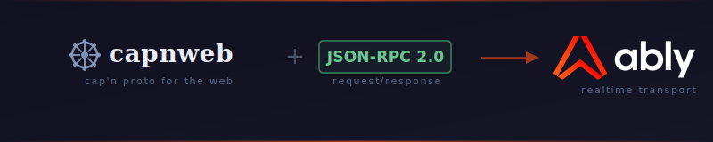

# @ably/rpc

<p align="center">
  
</p>

<p align="center">
  <a href="https://www.npmjs.com/package/@ably/rpc"></a>
  <a href="https://www.npmjs.com/package/@ably/rpc"></a>
  <a href="https://github.com/ably-labs/ably-rpc/actions/workflows/ci.yml"></a>
  <a href="https://github.com/ably-labs/ably-rpc/blob/main/LICENSE"></a>
  
</p>

> **Status: Experimental** - This library is under active development. APIs may change between minor versions. Install with `npm install @ably/rpc@beta`.

Run RPC protocols over [Ably](https://ably.com) pub/sub channels.

<p align="center">
  
</p>

## Why Ably for RPC?

Most RPC setups need you to run and scale your own WebSocket servers or message brokers. With Ably as the transport layer, the infrastructure problem goes away:

- **Message ordering guarantees** - Ably delivers messages in the order they were published, per channel. RPC request/response sequencing just works.
- **Connection recovery** - Clients reconnect and resume automatically. No dropped calls, no retry logic in your application code.
- **Global edge routing** - Messages route through the nearest Ably edge node. Low latency without deploying servers in every region.
- **No infrastructure to manage** - Your RPC logic lives entirely on the client and server. No middleware, no WebSocket servers, no message brokers to operate.

The result: a reliable transport for RPC in decoupled, distributed systems - which is most stateful internet applications.

## Features

- **JSON-RPC 2.0** - Standard request/response protocol with typed proxies
- **Cap'n Proto** - Binary serialization with promise pipelining and pass-by-reference via [capnweb](https://www.npmjs.com/package/capnweb)
- **Protocol-agnostic transport** - `AblyTransport` works with any RPC protocol that needs send/receive semantics
- **Echo filtering** - Messages from your own connection are automatically ignored
- **TypeScript-first** - Full type inference for local and remote method signatures
- **Dual-format** - Ships ESM and CJS builds

## Install

```bash
npm install @ably/rpc ably
```

For Cap'n Proto support, also install `capnweb`:

```bash
npm install @ably/rpc ably capnweb
```

## JSON-RPC Quick Start

```ts
import Ably from 'ably';
import { AblyTransport, JsonRpcSession } from '@ably/rpc';

// Use token auth — never expose your API key client-side
const ably = new Ably.Realtime({ authUrl: '/api/token' });
const channel = ably.channels.get('rpc:my-session');
const transport = new AblyTransport(channel, false, ably);
await transport.waitReady();

// Server side - expose methods
const session = new JsonRpcSession(transport, {
  async add(a: number, b: number) { return a + b; },
  async greet(name: string) { return `Hello, ${name}!`; },
});

// Client side - call remote methods
const remote = session.getRemoteMain();
await remote.add(2, 3);     // 5
await remote.greet('World'); // "Hello, World!"
```

## Cap'n Proto Quick Start

```ts
import Ably from 'ably';
import { RpcSession } from 'capnweb';
import { AblyTransport } from '@ably/rpc';

// Use token auth — never expose your API key client-side
const ably = new Ably.Realtime({ authUrl: '/api/token' });
const channel = ably.channels.get('rpc:my-session');
const transport = new AblyTransport(channel, false, ably);
await transport.waitReady();

// Pass AblyTransport directly to capnweb's RpcSession
const session = new RpcSession(transport, {
  async increment() { return ++counter; },
  async getValue() { return counter; },
});

const remote = session.getRemoteMain();
await remote.increment(); // promise pipelining, pass-by-reference
```

## Architecture

```
┌──────────────────┐    ┌──────────────────┐
│     Client A     │    │     Client B     │
│                  │    │                  │
│  JsonRpcSession  │    │  JsonRpcSession  │
│    or capnweb    │    │    or capnweb    │
│         │        │    │         │        │
│  AblyTransport   │    │  AblyTransport   │
└─────────┬────────┘    └─────────┬────────┘
          │   ┌──────────────┐    │
          │   │              │    │
          └───► Ably Channel ◄────┘
              │              │
              │  • ordering  │
              │  • recovery  │
              │  • edge CDN  │
              └──────────────┘
```

Both clients publish to and subscribe on the same Ably channel. `AblyTransport` handles serialization, message queuing, and echo filtering. The RPC session (JSON-RPC or Cap'n Proto) handles protocol framing on top.

## API Reference

### `AblyTransport`

Bridges an Ably `RealtimeChannel` to a send/receive transport interface.

```ts
new AblyTransport(channel: Ably.RealtimeChannel, debug?: boolean, ably?: Ably.Realtime)
```

- **`waitReady()`** - Wait for the channel to attach
- **`send(message: string)`** - Send a message (serialized to preserve ordering)
- **`receive()`** - Receive the next message (queues if none waiting)
- **`abort(reason)`** - Abort the transport with an error
- **`close()`** - Close the transport cleanly

The `ably` parameter enables echo filtering (messages from your own connection are ignored).

### `JsonRpcSession<Remote, Local>`

JSON-RPC 2.0 session over the transport. Registers local methods, provides a proxy for remote calls.

```ts
new JsonRpcSession(transport: AblyTransport, localApi: Local)
```

- **`getRemoteMain()`** - Returns a typed proxy; property access maps to JSON-RPC requests
- **`close()`** - Stop the receive loop and reject pending requests

### `ProtocolSession<Remote>`

Interface satisfied by both `JsonRpcSession` and capnweb's `RpcSession`:

```ts
interface ProtocolSession<Remote> {
  getRemoteMain(): Remote;
  close?: () => void;
}
```

Use this type when writing protocol-agnostic code.

## Demo

The `demo/` directory contains a full working example: a counter app with bidirectional RPC between browser tabs, supporting both JSON-RPC 2.0 and Cap'n Proto.

```bash
cd demo
cp .env.example .env  # add your Ably API key
npm install
npm run dev
```

## Contributing

1. Fork the repo
2. Create a feature branch (`git checkout -b my-feature`)
3. Run tests (`npm test`) and build (`npm run build`)
4. Open a pull request

## License

[Apache 2.0](LICENSE)
